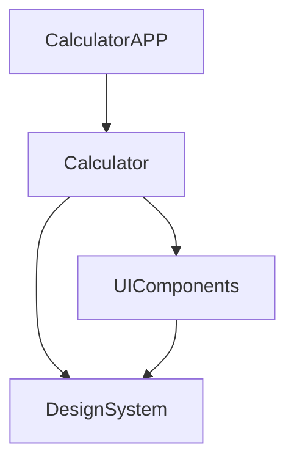

25/07/2024

Estudo: SPM / Targuet 12.

Passo1:
Criar o Package.swift:

// CalculatorApp/Package.swift

// swift-tools-version:5.3
import PackageDescription

let package = Package(
    name: "CalculatorApp",
    platforms: [
        .iOS(.v12)
    ],
    products: [
        .executable(
            name: "CalculatorApp",
            targets: ["CalculatorApp"]),
    ],
    dependencies: [
        .package(path: "../DesignSystem"),
        .package(path: "../UIComponents")
    ],
    targets: [
        .target(
            name: "CalculatorApp",
            dependencies: ["DesignSystem", "UIComponents"]),
        .testTarget(
            name: "CalculatorAppTests",
            dependencies: ["CalculatorApp"]),
    ]
)

Passo 2: gerar a estrutura de diretórios:

mkdir -p Sources/DesignSystem
mkdir -p Tests/DesignSystemTests

Passo 3: Criar o projeto. (Não gerou)
Mas o Xcode abre o package...

$ swift package generate-xcodeproj

-------------

mkdir -p Sources/UIComponents
mkdir -p Tests/UIComponentsTests

--------------

mkdir -p Sources/CalculatorAPP
mkdir -p Tests/CalculatorAPPTests

--------------

